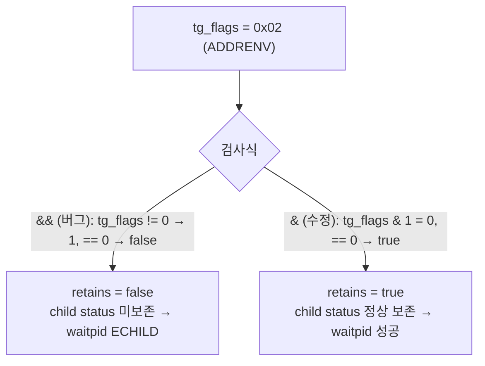
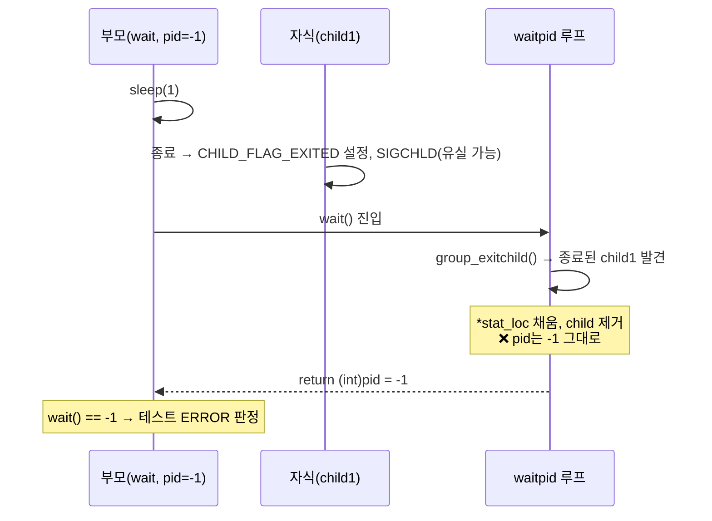
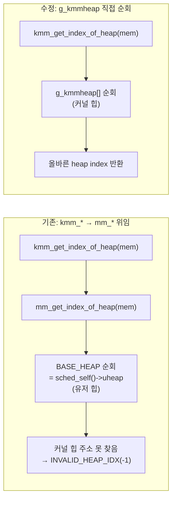

# OS API Test 도입 중 발견·수정한 커널 이슈 정리

본 문서는 `os_api_test`(커널 내부 API를 직접 호출·검증하는 테스트 드라이버)를 추가하면서
**테스트 코드가 아닌 커널/MM 코드 자체에 존재하던 결함**을 발견하고 수정한 내용을 정리한다.

## 배경 / 실행 환경

- 보드: **RTL8730E** (`rtl8730e/loadable_ext_ddr_st7785`)
- 빌드: **`CONFIG_BUILD_PROTECTED=y`** (커널/유저 주소공간 분리)
- **`CONFIG_SMP=y`, `CONFIG_SMP_NCPUS=2`** (듀얼코어)
- 관련 config: `CONFIG_SCHED_HAVE_PARENT`, `CONFIG_SCHED_CHILD_STATUS`,
  `CONFIG_PRIORITY_INHERITANCE`, `CONFIG_MM_KERNEL_HEAP`

이 환경 특성(주소공간 분리 + SMP)이 기존에 드러나지 않던 결함들을 노출시켰다.

## 이슈 요약

| # | 파일 | 분류 | 증상 |
|---|------|------|------|
| 1 | `kernel/group/group_signal.c` | 컴파일 오류 | SMP 빌드에서 세미콜론 누락으로 빌드 실패 |
| 2 | `kernel/task/task_setup.c`, `kernel/sched/sched_waitpid.c`, `kernel/sched/sched_waitid.c`, `kernel/task/task_reparent.c` | 논리 버그 | `GROUP_FLAG_NOCLDWAIT` 검사에 `&&`(논리 AND) 오용 |
| 3 | `kernel/sched/sched_waitpid.c` | 논리 버그 | `wait()`가 종료된 자식의 PID 대신 `-1` 반환 |
| 4 | `mm/kmm_heap/kmm_getheap.c` | 논리 버그 | 커널 힙 조회 API가 protected 빌드에서 유저 힙을 조회 |

---

## 1. `group_signal.c` — SMP 빌드 컴파일 오류

### 증상
`CONFIG_SMP=y`에서 `group_signal()` 컴파일 실패.

### 원인
`enter_critical_section()` 호출문에 세미콜론이 빠져 있었다. `#ifdef CONFIG_SMP` 안에만
있어서 비SMP 빌드에서는 드러나지 않았다.

```c
#ifdef CONFIG_SMP
	irqstate_t flags = enter_critical_section()   /* ← 세미콜론 누락 */
#else
	sched_lock();
#endif
```

### 수정
세미콜론 추가.

```c
	irqstate_t flags = enter_critical_section();
```

---

## 2. `GROUP_FLAG_NOCLDWAIT` — 논리 AND(`&&`) vs 비트 AND(`&`)

### 증상
`kernel_thread()`/`task_create()`로 만든 자식을 `waitpid()`/`wait()`로 회수하면
`ECHILD`가 반환되거나, 자식의 exit status가 부모 그룹에 등록되지 않음.
→ `tc_task_lifecycle_test`가 `waitpid` 단계에서 실패.

### 원인
`GROUP_FLAG_NOCLDWAIT`(자식 종료 상태를 보존하지 않겠다는 플래그, `= 1<<0`) 검사에
비트 연산 `&` 대신 논리 연산 `&&`를 사용.

```c
retains = ((rtcb->group->tg_flags && GROUP_FLAG_NOCLDWAIT) == 0);
```

`tg_flags && GROUP_FLAG_NOCLDWAIT` 는 `(tg_flags != 0) && (1 != 0)` 이므로
사실상 `tg_flags != 0` 과 같다. 따라서 식은 **`tg_flags == 0`** 을 의미하게 되어,
`NOCLDWAIT` 비트와 무관하게 **다른 플래그가 하나라도 켜져 있으면** "자식 상태를 보존하지
않음(retains=false)"으로 잘못 판정된다.

- protected/주소공간 그룹은 `GROUP_FLAG_ADDRENV(1<<1=2)`,
- 커널 스레드 그룹은 `GROUP_FLAG_PRIVILEGED(1<<2=4)` 가 켜지므로

이 그룹들이 전부 `retains=false`로 처리되어 child status가 등록/조회되지 않았다.



### 수정
논리 AND를 비트 AND로 변경 (4개 파일, 총 7곳).

```c
retains = ((rtcb->group->tg_flags & GROUP_FLAG_NOCLDWAIT) == 0);
```

| 파일 | 위치 |
|------|------|
| `kernel/task/task_setup.c` | `task_saveparent()` — child status 등록 조건 |
| `kernel/sched/sched_waitpid.c` | `waitpid()` — `retains` 계산 |
| `kernel/sched/sched_waitid.c` | `waitid()` — `retains` 계산 |
| `kernel/task/task_reparent.c` | 4곳 (reparent 시 old/new 그룹 처리) |

> 참고: `task_exithook.c`의 동일 검사는 원래부터 `&`로 올바르게 되어 있었다.

---

## 3. `wait()` / `waitpid(-1)` — fast-path에서 자식 PID 미갱신

### 증상
`wait()` 및 `waitpid(-1, ...)`이 종료된 자식의 PID를 반환하지 않고 `-1`(ERROR) 또는
**엉뚱한 이전 자식의 PID**를 반환.

### 원인
TinyAra는 시그널을 큐잉하지 않으므로 SIGCHLD가 유실될 수 있다. `waitpid`에는 이를
보완하는 "missed-signal recovery" fast-path가 있다: `pid == -1`(=`wait()`)일 때
`group_exitchild()`로 이미 종료된 자식을 직접 찾아 즉시 반환한다.

그런데 이 fast-path는 자식의 exit status를 `*stat_loc`에는 채우면서 **반환값 `pid`를
자식의 PID로 갱신하지 않고** `break` 했다. 함수 말미의 `return (int)pid`는 원래 인자값
`-1`을 그대로 반환한다. (시그널을 실제로 수신하는 경로에는 `pid = info.si_pid;`가 있으나,
fast-path에는 대응 코드가 누락)

```c
if (retains && (child = group_exitchild(rtcb->group)) != NULL) {
    if (stat_loc != NULL) {
        *stat_loc = child->ch_status << 8;
    }
    /* pid 갱신 없음 → return (int)pid 가 -1 반환 */
    (void)group_removechild(rtcb->group, child->ch_pid);
    group_freechild(child);
    break;
}
```



### 수정
fast-path에서 `break` 전에 자식 PID를 반환값에 반영. (`group_freechild()`가 `child`를
해제하므로 그 전에 저장)

```c
    if (stat_loc != NULL) {
        *stat_loc = child->ch_status << 8;
    }

    /* pid == -1 호출자(wait 등)는 자식 PID를 반환값으로 기대한다.
     * 이 갱신이 없으면 fast-path가 -1을 그대로 반환한다. */
    pid = child->ch_pid;

    (void)group_removechild(rtcb->group, child->ch_pid);
    group_freechild(child);
    break;
```

---

## 4. `kmm_get_heap_with_index()` / `kmm_get_index_of_heap()` — 유저 힙 오조회

### 증상
`tc_kmm_heap_test` 실패. `kmm_malloc()`으로 커널 힙에서 할당한 포인터에 대해
`kmm_get_heap(mem)`은 힙을 올바로 찾는데(non-NULL), `kmm_get_index_of_heap(mem)`은
`-1`(`INVALID_HEAP_IDX`)을 반환하는 모순.

### 원인
두 커널 힙 조회 함수가 일반 MM 함수(`mm_get_heap_with_index()`, `mm_get_index_of_heap()`)에
그대로 위임하고 있었다. 이 MM 함수들은 `BASE_HEAP` 매크로를 순회하는데,
**`CONFIG_BUILD_PROTECTED` + `__KERNEL__`** 에서 `BASE_HEAP`는 다음과 같이 정의된다:

```c
#define BASE_HEAP ((struct mm_heap_s *)((struct tcb_s*)sched_self())->uheap)
```

즉 **현재 태스크의 유저 힙**을 가리킨다. 따라서 커널 힙(`g_kmmheap`)에서 할당된 주소는
유저 힙 범위에서 절대 발견되지 않아 `INVALID_HEAP_IDX`가 반환됐다.



### 수정
두 함수가 커널 힙 배열 `g_kmmheap`을 **직접** 순회하도록 변경.

```c
struct mm_heap_s *kmm_get_heap_with_index(int index)
{
	if (index >= CONFIG_KMM_NHEAPS) {
		mdbg("heap index is out of range.\n");
		return NULL;
	}
	return &g_kmmheap[index];
}

int kmm_get_index_of_heap(void *mem)
{
	int heap_idx;

	if (mem == NULL) {
		return INVALID_HEAP_IDX;
	}
	for (heap_idx = 0; heap_idx < CONFIG_KMM_NHEAPS; heap_idx++) {
		int region = 0;
#if CONFIG_KMM_REGIONS > 1
		for (; region < g_kmmheap[heap_idx].mm_nregions; region++)
#endif
		{
			if ((mem > (void *)g_kmmheap[heap_idx].mm_heapstart[region]) &&
			    (mem < (void *)g_kmmheap[heap_idx].mm_heapend[region])) {
				return heap_idx;
			}
		}
	}
	return INVALID_HEAP_IDX;
}
```

---

## 부록: 테스트 측 개선 사항

### A. SMP 타이밍 대응 (`test_task.c`)

커널 결함은 아니지만 기록해 둔다. `task_terminate()`는 `task_exithook()`에서
`CHILD_FLAG_EXITED` 설정 + SIGCHLD 전송을 한 **뒤에** `sched_releasetcb()`로 PID를 해제한다.
`waitpid`는 `CHILD_FLAG_EXITED`만 보면 즉시 반환하므로, **SMP에서 부모(다른 CPU)가
자식의 PID 해제 전에** `waitpid`를 빠져나올 수 있다. 이 경우 곧바로 `task_delete(pid)`를
호출하면 아직 TCB가 살아 있어 `ESRCH` 대신 `OK`가 반환된다.

`tc_task_lifecycle_test`는 이 구간을 결정적으로 만들기 위해, `waitpid` 후 PID가 실제로
해제될 때까지 대기하는 헬퍼(`test_task_wait_released()`, `sched_gettcb(pid)==NULL` 폴링)를
드라이버 측에 두었다. 커널 exit 경로 자체는 광범위한 영향을 우려하여 수정하지 않았다.

### B. `wait(-1)` 사용 제거 (`tc_sched.c`)

`wait(-1, ...)`은 POSIX 표준 용법이지만, 테스트 환경의 SMP 타이밍과
이전 테스트 모듈에서 누수된 좀비 자식의 조합으로 **엉뚱한 자식 PID**를 회수할 수 있다.

`tc_sched_wait()` 원래 코드:
```c
wait(&status);  /* 아무 자식이나 회수 → 다른 테스트의 PID 35 회수 */
sleep(2);       /* child2 회수 안 함 → 다음 테스트로 좀비 누수 */
```

수정 후:
```c
waitpid(child1_pid, &status, 0);  /* child1 명시적 회수 */
sleep(1);
waitpid(child2_pid, &status, 0);  /* child2도 명시적 회수 → 누수 방지 */
```

이렇게 하면:
- 특정 자식만 기다려 SMP 타이밍 영향 최소화
- 모든 생성한 자식을 명시적으로 회수 → 테스트 격리 개선
- 자식 누수 방지
